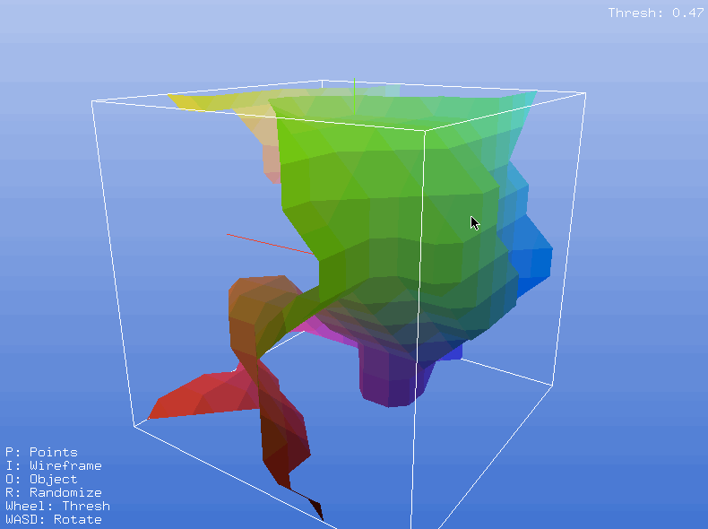

# MarchingCubesVisualizer
An OpenGL based Marching Cubes Algorithm visualizer written in Python using Pygame for context management / user input.

My own version of the Marching Cubes Algorithm is implemented here. A single polygon is found for each unit cube in the randomly generated world-space. No winding is checked, as backside-culling is disabled to allow the user to look 'inside' the generated mesh. This implementation is extremely inefficient compared to a LUT based approach, but where's the fun in that?

## Running the application

Run `python3 MarchingCubes.py` to run the application. There are a few commandline options you can modify to control how it runs:
- `-w` or `--worldSize`<int, must be even> will set the length of each side of the cube that represents the world-space; defulats to `10`.
- `-r` or `--viewRadius` <int, greater than 0> will set the radius of the camera arm that pans around the center of the world-space; defaults to `20`.
- `-d` or `--debug` <bool> will enable a console printout of the time each task in the application's main loop takes for debugging purposes; defaults to `False`.
- `-x` or `--screenWidth` <int, greater than 0> will set the screen width in pixels; defaults to 800.
- `-y` or `--screenHeight` <int, greater than 0> will set the screen height in pixels; defaults to 600.

## View Modes
There are three view modes the user can toggle between:
- **Point Mode:** Black or white spheres are rendered at each point in the world-space; black spheres indicate points that are _less than or equal to_ the current threshold value while white spheres indicate points that are _greater tahn_ the current threshold value.
- **Wireframe Mode:** Draws a colored wireframe of the mesh generated by the current world-space and the Marching Cubes Algorithm.
- **Mesh Mode:** Draws a colored polygonal mesh generated by the Marching Cubes Algorithm

